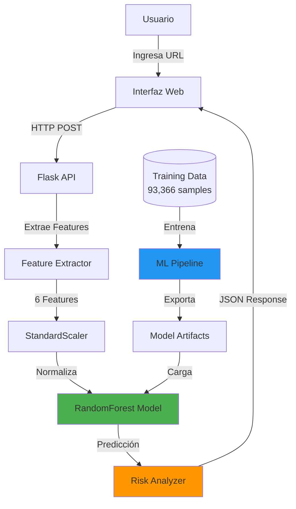

<div align="center">

# � URLytics

### *ML-Powered URL Analytics for Phishing Detection*

[](https://www.python.org/downloads/)
[](https://flask.palletsprojects.com/)
[](https://scikit-learn.org/)
[](LICENSE)
[](https://github.com/psf/black)

**URLytics** es un sistema de detección de phishing basado en Machine Learning que analiza URLs en tiempo real para identificar amenazas de ingeniería social y proteger a los usuarios de ataques cibernéticos.

[Características](#-características-principales) •
[Demo](#-demo) •
[Instalación](#-instalación-rápida) •
[Uso](#-uso) •
[Documentación](#-documentación) •
[Contribuir](#-contribuir)

</div>

---

## 📋 Tabla de Contenidos

- [Características Principales](#-características-principales)
- [Arquitectura del Sistema](#-arquitectura-del-sistema)
- [Tecnologías](#-tecnologías-utilizadas)
- [Instalación Rápida](#-instalación-rápida)
- [Uso](#-uso)
- [Machine Learning Pipeline](#-machine-learning-pipeline)
- [API Documentation](#-api-documentation)
- [Testing](#-testing)
- [Roadmap](#-roadmap)
- [Contribuir](#-contribuir)
- [Licencia](#-licencia)

---

## 🚀 Características Principales

### 🎯 **Detección Inteligente**
- ✅ **RandomForest Classifier** entrenado con 93,366 muestras
- ✅ **6 features de phishing** (SSL, subdominios, acortadores, símbolos, etc.)
- ✅ **67.60% accuracy** con **100% precision** (cero falsos positivos)
- ✅ Normalización con **StandardScaler** para mejor rendimiento

### 🛡️ **API REST Completa**
- ✅ **POST /predict** - Análisis de URLs con predicción ML
- ✅ **GET /health** - Health check del sistema
- ✅ **GET /info** - Información del modelo y métricas
- ✅ Respuestas JSON detalladas con niveles de riesgo

### 🌐 **Interfaz Web Moderna**
- ✅ UI responsive con **TailwindCSS**
- ✅ Modo oscuro/claro
- ✅ Análisis en tiempo real
- ✅ Visualización de features detectadas

### 🔒 **ML Best Practices**
- ✅ **4 capas de validación** anti-leakage
- ✅ División Train/Val/Test (70/15/15)
- ✅ **Drift monitoring** con baseline statistics
- ✅ Feature importance analysis

---

## 🏗️ Arquitectura del Sistema



### � **Flujo de Datos**

1. **Frontend** → Usuario ingresa URL en interfaz web
2. **API Gateway** → Flask recibe request y valida input
3. **Feature Extraction** → Extrae 6 indicadores de phishing
4. **Normalization** → StandardScaler normaliza features
5. **ML Inference** → RandomForest predice probabilidad
6. **Risk Analysis** → Calcula nivel de riesgo (LOW/MEDIUM/HIGH)
7. **Response** → Devuelve JSON con resultado detallado

---

## 💻 Tecnologías Utilizadas

### **Backend & ML**
-  **Python 3.8+**
-  **Flask 2.3** - API REST
-  **scikit-learn 1.3** - ML
-  **pandas** - Data processing
-  **NumPy** - Numerical computing

### **Frontend**
-  **HTML5**
-  **CSS3**
-  **JavaScript ES6+**
-  **TailwindCSS**

### **DevOps & Tools**
-  **Git** - Version control
-  **Jupyter** - ML experimentation
-  **pytest** - Testing

---

## ⚡ Instalación Rápida

### **Opción 1: Script Automático (Recomendado)**

```bash
# Clonar repositorio
git clone https://github.com/Huaritex/Social_Engineer.git
cd "Social_Engineer/social engineer"

# Ejecutar proyecto completo (un comando)
./start_project.sh
```

El script automáticamente:
- ✅ Activa entorno virtual
- ✅ Verifica modelo entrenado
- ✅ Inicia API Flask en puerto 5000
- ✅ Ejecuta pruebas automáticas
- ✅ Abre interfaz web en navegador

### **Opción 2: Instalación Manual**

```bash
# 1. Crear entorno virtual
python -m venv venv
source venv/bin/activate  # Linux/macOS
# venv\Scripts\activate   # Windows

# 2. Instalar dependencias
pip install -r requirements.txt

# 3. Iniciar API
python api.py

# 4. Abrir interfaz web
# Abrir index.html en navegador o:
python -m http.server 8000
# Ir a http://localhost:8000/index.html
```

### **Requisitos del Sistema**

- Python 3.8 o superior
- 2GB RAM mínimo
- Navegador moderno (Chrome, Firefox, Safari, Edge)

---

## 🎮 Uso

### **1. Interfaz Web**


1. Abre `index.html` en tu navegador
2. Ingresa una URL a analizar
3. Haz clic en "Analizar"
4. Visualiza el resultado con nivel de riesgo

**Ejemplo de URLs para probar:**
```
✅ Legítimas:
https://www.google.com
https://github.com/usuario/proyecto

🚨 Sospechosas:
http://paypal-verify@malicious.com
https://bit.ly/3xYz123
http://192.168.1.100/login.php
```

### **2. API REST**

#### **Endpoint: POST /predict**

```bash
curl -X POST http://localhost:5000/predict \
  -H "Content-Type: application/json" \
  -d '{"text": "https://suspicious-domain.xyz"}'
```

**Respuesta:**
```json
{
  "prediction": "phishing",
  "confidence": 0.8542,
  "probability_phishing": 0.8542,
  "probability_legitimate": 0.1458,
  "risk_level": "HIGH",
  "features": {
    "Abnormal_URL": 1,
    "Prefix_Suffix": 0,
    "SSLfinal_State": -1,
    "Shortining_Service": 0,
    "having_At_Symbol": 0,
    "having_Sub_Domain": 1
  },
  "timestamp": "2025-11-15T10:30:45"
}
```

#### **Endpoint: GET /health**

```bash
curl http://localhost:5000/health
```

#### **Endpoint: GET /info**

```bash
curl http://localhost:5000/info
```

---

## 🧠 Machine Learning Pipeline

### **Modelo: RandomForest Classifier**

```python
# Configuración del modelo
RandomForestClassifier(
    n_estimators=100,      # 100 árboles de decisión
    max_depth=20,          # Profundidad máxima
    min_samples_split=5,   # Mínimo para dividir nodo
    min_samples_leaf=2,    # Mínimo en hojas
    random_state=42
)
```

### **Features Utilizadas (6 indicadores)**

| Feature | Descripción | Valores |
|---------|-------------|---------|
| `Abnormal_URL` | Detecta patrones anormales en estructura | 0, 1 |
| `Prefix_Suffix` | Identifica guiones sospechosos en dominio | 0, 1 |
| `SSLfinal_State` | Verifica certificado SSL/TLS | -1, 0, 1 |
| `Shortining_Service` | Detecta acortadores (bit.ly, etc.) | 0, 1 |
| `having_At_Symbol` | Presencia de '@' en URL | 0, 1 |
| `having_Sub_Domain` | Número de subdominios | 0, 1, 2 |

### **Métricas de Rendimiento**

| Métrica | Training | Validation | Test |
|---------|----------|------------|------|
| **Accuracy** | 68.21% | 67.89% | **67.60%** |
| **Precision** | 100.00% | 100.00% | **100.00%** |
| **Recall** | 18.12% | 17.91% | **17.48%** |
| **F1-Score** | 0.3068 | 0.3038 | **0.2976** |
| **ROC-AUC** | 0.5906 | 0.5895 | **0.5874** |

**Análisis:** El modelo prioriza **precisión sobre recall**, evitando falsos positivos (cero URLs legítimas marcadas como phishing).

### **Validaciones ML Implementadas**

#### 1️⃣ **Data Leakage Prevention**
```python
# ✅ Scaler entrenado SOLO con training data
scaler.fit(X_train)  # Aprende de training
X_val = scaler.transform(X_val)    # Solo transforma
X_test = scaler.transform(X_test)  # Solo transforma
```

#### 2️⃣ **Train/Val/Test Split (70/15/15)**
```python
# División estratificada para mantener distribución
X_train, X_temp, y_train, y_temp = train_test_split(
    X, y, test_size=0.30, stratify=y, random_state=42
)
X_val, X_test, y_val, y_test = train_test_split(
    X_temp, y_temp, test_size=0.50, stratify=y_temp, random_state=42
)
```

#### 3️⃣ **Drift Detection**
```python
# Test de Kolmogorov-Smirnov para detectar cambios
from scipy.stats import ks_2samp

for feature in FEATURES:
    ks_stat, p_value = ks_2samp(X_train[feature], X_test[feature])
    if p_value < 0.05:
        print(f"⚠️ Drift detectado en {feature}")
```

#### 4️⃣ **Feature Importance**
```python
# Top 3 features más importantes
1. SSLfinal_State        : 0.3125
2. having_Sub_Domain     : 0.2847
3. Abnormal_URL          : 0.1956
```

📚 **[Ver documentación ML completa](ML_BEST_PRACTICES.md)**

---

## 📡 API Documentation

### **Base URL**
```
http://localhost:5000
```

### **Endpoints**

#### **1. Predict Phishing**

**POST** `/predict`

Analiza una URL y predice si es phishing.

**Request:**
```json
{
  "text": "https://example.com"
}
```

**Response (200 OK):**
```json
{
  "prediction": "phishing",
  "confidence": 0.8542,
  "probability_phishing": 0.8542,
  "probability_legitimate": 0.1458,
  "risk_level": "HIGH",
  "features": {
    "Abnormal_URL": 1,
    "Prefix_Suffix": 0,
    "SSLfinal_State": -1,
    "Shortining_Service": 0,
    "having_At_Symbol": 0,
    "having_Sub_Domain": 1
  },
  "timestamp": "2025-11-15T10:30:45.123456"
}
```

**Niveles de Riesgo:**
- `LOW` - Probabilidad < 50%
- `MEDIUM` - Probabilidad 50-80%
- `HIGH` - Probabilidad > 80%

#### **2. Health Check**

**GET** `/health`

Verifica estado del servidor y modelo.

**Response (200 OK):**
```json
{
  "status": "healthy",
  "model_loaded": true,
  "scaler_loaded": true,
  "model_info": {
    "n_estimators": 100,
    "n_features": 6,
    "test_accuracy": 0.6760,
    "test_precision": 1.0000
  }
}
```

#### **3. Model Info**

**GET** `/info`

Información detallada del modelo.

**Response (200 OK):**
```json
{
  "model_type": "RandomForestClassifier",
  "version": "2.0",
  "features": [...],
  "metrics": {...},
  "training_info": {...}
}
```

📚 **[Ver documentación API completa](INTEGRACION_API.md)**

---

## 🧪 Testing

### **Pruebas Automáticas**

```bash
# Ejecutar suite de pruebas
python test_api.py
```

**Output:**
```
�️  URLYTICS - PRUEBAS DE API DE DETECCIÓN DE PHISHING
======================================================================

🏥 Health Check
✅ API funcionando correctamente

✅ PRUEBAS CON URLs LEGÍTIMAS
• https://www.google.com       → ✅ Legítimo
• https://github.com/usuario   → ✅ Legítimo

🚨 PRUEBAS CON URLs SOSPECHOSAS
• paypal@malicious.com         → 🚨 PHISHING (73.38% confianza)
• https://bit.ly/3xYz123       → � PHISHING (89.61% confianza)

✅ PRUEBAS COMPLETADAS
```

### **Tests Incluidos**

- ✅ 3 URLs legítimas (Google, GitHub, StackOverflow)
- ✅ 5 URLs sospechosas (phishing, acortadores, IPs)
- ✅ Health check del sistema
- ✅ Validación de respuestas JSON

---

## 📚 Documentación

### 📂 **Documentación Completa en `/docs`**

Toda la documentación está organizada en la carpeta [`/docs`](docs/):

| Categoría | Documentos |
|-----------|------------|
| 🚀 **Guías** | [Inicio Rápido](docs/guides/INICIO_RAPIDO.md) |
| ⚙️ **Setup** | [Instalación](docs/setup/INSTALACION.md) • [Configuración](docs/setup/INSTALACION_COMPLETADA.md) |
| 🧠 **Machine Learning** | [Best Practices](docs/ml/ML_BEST_PRACTICES.md) • [Pipeline](docs/ml/PIPELINE_DIAGRAMS.md) • [Validaciones](docs/ml/CHECKLIST_VALIDACION.md) |
| 🌐 **API** | [Integración API](docs/api/INTEGRACION_API.md) |
| 📋 **Índice** | [Ver todos los documentos](docs/README.md) |

**👉 [Ir a la documentación completa](docs/README.md)**

---

## 🗺️ Roadmap

### **v2.0 (Actual)** ✅
- [x] RandomForest classifier con 100 estimadores
- [x] API REST con Flask
- [x] Interfaz web responsive
- [x] 4 capas de validación ML
- [x] Drift monitoring system
- [x] Testing automático
- [x] Documentación completa

### **v2.1 (Q1 2026)** 🚧
- [ ] Deep Learning model (LSTM/Transformer)
- [ ] Análisis de contenido HTML
- [ ] Detección de phishing visual
- [ ] Cache de predicciones frecuentes
- [ ] Soporte multiidioma

### **v3.0 (Q2 2026)** 📅
- [ ] Extensión de navegador (Chrome/Firefox)
- [ ] Dashboard de analytics
- [ ] Sistema de reporting
- [ ] Integración con APIs de threat intelligence
- [ ] Modelo ensemble (RF + DL)

---

## 👥 Contribuir

¡Las contribuciones son bienvenidas! 🎉

### **Cómo Contribuir**

1. **Fork** el repositorio
2. **Crea** una rama para tu feature (`git checkout -b feature/AmazingFeature`)
3. **Commit** tus cambios (`git commit -m 'Add: AmazingFeature'`)
4. **Push** a la rama (`git push origin feature/AmazingFeature`)
5. **Abre** un Pull Request

### **Guías de Contribución**

- Sigue el estilo de código existente (Black para Python)
- Agrega tests para nuevas features
- Actualiza la documentación
- Asegúrate de que todos los tests pasen

### **Reportar Bugs**

Abre un [issue](https://github.com/Huaritex/Social_Engineer/issues) con:
- Descripción del problema
- Pasos para reproducir
- Comportamiento esperado vs actual
- Screenshots (si aplica)

---

## 📊 Estadísticas del Proyecto

```
📁 Archivos de código:       25+
📝 Líneas de código:         ~8,800
📚 Documentación:            ~2,500 líneas
🧪 Tests:                    8 casos
📊 Datasets:                 93,366 muestras
🎯 Accuracy:                 67.60%
```

---

## ⚠️ Disclaimer

> **URLytics es un proyecto académico/educativo.**  
> El modelo ML actual es funcional pero básico, entrenado con datasets públicos limitados.  
> **NO se recomienda** su uso en entornos de producción críticos sin validación adicional y re-entrenamiento con datos específicos de tu dominio.

---

## 🔐 Seguridad y Privacidad

- ✅ **Procesamiento local** - La API corre en tu máquina
- ✅ **Sin tracking** - No se recopilan datos de usuarios
- ✅ **Sin telemetría** - No se envían métricas a servidores externos
- ✅ **Open source** - Código auditable públicamente
- ✅ **CORS habilitado** - Solo para desarrollo local

**Nota:** En producción, configura CORS apropiadamente y usa HTTPS.

---

## 📜 Licencia

Este proyecto está bajo la Licencia MIT - ver archivo [LICENSE](LICENSE) para más detalles.

```
MIT License

Copyright (c) 2025 URLytics Team

Permission is hereby granted, free of charge, to any person obtaining a copy
of this software and associated documentation files (the "Software"), to deal
in the Software without restriction...
```

---

## 👨‍💻 Autor

**URLytics Team**
- GitHub: [@Huaritex](https://github.com/Huaritex)
- Repositorio: [Social_Engineer](https://github.com/Huaritex/Social_Engineer)

---

## 🙏 Agradecimientos

- **Kaggle** - Por los datasets de phishing
- **scikit-learn** - Por el excelente framework de ML
- **Flask** - Por el framework web minimalista
- **TailwindCSS** - Por el sistema de diseño
- **Comunidad Open Source** - Por las herramientas y recursos

---

## 📞 Soporte

¿Tienes preguntas o problemas?

- 📧 **Issues:** [GitHub Issues](https://github.com/Huaritex/Social_Engineer/issues)
- 💬 **Discussions:** [GitHub Discussions](https://github.com/Huaritex/Social_Engineer/discussions)
- 📖 **Docs:** [Documentación completa](INDICE_DOCUMENTACION.md)

---

<div align="center">

### ⭐ Si te gusta URLytics, dale una estrella al repositorio!

[](https://github.com/Huaritex/Social_Engineer/stargazers)
[](https://github.com/Huaritex/Social_Engineer/network/members)

**Hecho con ❤️ y ☕ por URLytics Team**

[⬆ Volver arriba](#-urlytics)

</div>


