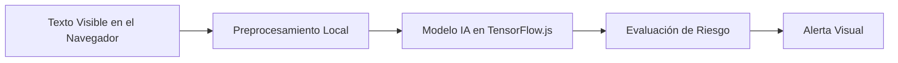

---

# 🛡️ URLytics

**Detección Inteligente de Ingeniería Social en Tiempo Real**
URLytics es una extensión de navegador potenciada por inteligencia artificial que analiza mensajes en tiempo real (en plataformas como Gmail o WhatsApp Web) para detectar patrones comunes de **ingeniería social**, como **phishing**, **manipulación emocional** o **solicitudes sospechosas**.

> 🧠 Todo el procesamiento ocurre **localmente** en el navegador, garantizando **confidencialidad, integridad y disponibilidad (CID)**.

---

## 🎯 Objetivo

Crear una herramienta **educativa y preventiva** que utilice IA para ayudar a los usuarios a identificar amenazas sociales digitales, priorizando **privacidad** y **seguridad**.

---

## ✨ Características Destacadas

* 🔁 **Análisis en Tiempo Real**: Detecta patrones de ataque directamente en el navegador.
* 🎨 **Modo Oscuro/Claro**: Mejora la experiencia del usuario según sus preferencias.
* 🧪 **Área de Prueba de Texto**: Simula el análisis de mensajes.
* 🚨 **Alertas Dinámicas**: Notificaciones visuales ante sospechas de ingeniería social.
* 📊 **Resultados Detallados**: Nivel de riesgo, puntuaciones y explicación del análisis.
* 🧠 **TensorFlow\.js**: Inferencia de IA directamente en el cliente.
* 💡 **Interruptor de Simulación**: Activa o desactiva el comportamiento de la extensión.
* 🛡️ **ML Best Practices**: Protección contra data leakage, drift detection y validaciones robustas.

---

## 🔬 Mejoras de Machine Learning v2.0

### 🎓 **Validaciones Anti-Leakage Implementadas**

Este proyecto implementa **4 capas de protección** contra problemas comunes en ML:

#### 1️⃣ **Data Leakage Prevention**
- ✅ Scaler entrenado **SOLO** con datos de training
- ✅ Sin overlap entre conjuntos Train/Val/Test
- ✅ Análisis de correlaciones para detectar features "mágicas"

#### 2️⃣ **Test Contamination Prevention**
- ✅ División en 3 conjuntos (70% Train / 15% Validation / 15% Test)
- ✅ Test set **NUNCA** usado para ajustar hiperparámetros
- ✅ Estratificación correcta del target

#### 3️⃣ **Data/Concept Drift Detection**
- ✅ Test de Kolmogorov-Smirnov entre Train y Test
- ✅ Baseline statistics guardadas para monitoreo en producción
- ✅ Sistema de alertas para re-entrenamiento

#### 4️⃣ **Hidden Feature Leakage Detection**
- ✅ Análisis de correlación feature→target
- ✅ Validación de varianza de features
- ✅ Feature importance sanity checks

📚 **[Leer documentación completa](ML_BEST_PRACTICES.md)**

---

## 🧰 Tecnologías Utilizadas

| Frontend                        | Backend / IA               | Otros                     |
| ------------------------------- | -------------------------- | ------------------------- |
| JavaScript, HTML, CSS           | Python (Keras, TensorFlow) | TailwindCSS, Google Colab |
| TensorFlow\.js                  | scikit-learn               | VSCode                    |
| spaCy / Transformers (opcional) | numpy, scipy               | GitHub                    |

---

## 🧠 Arquitectura del Sistema



* **Extensión Web**: HTML/JS + TailwindCSS para la interfaz y lógica.
* **Modelo IA**: Entrenado en Python y exportado a TensorFlow\.js.
* **Procesamiento 100% local**: No se transmiten datos sensibles.

---

## 🧪 Requisitos Funcionales y No Funcionales

### ✅ Funcionales

* Detección de patrones de ingeniería social en texto visible.
* Análisis en tiempo real.
* Generación de alertas visuales no intrusivas.
* Ejecución del modelo en el cliente.
* Control on/off del análisis.

### 🧩 No Funcionales

* Bajo consumo de recursos.
* Totalmente offline y sin almacenamiento de datos.
* Compatible con navegadores modernos.

---

## ⚙️ Configuración y Ejecución

### 1. Entrenamiento del Modelo (Python)

```bash
# Crea y activa entorno virtual (opcional)
python -m venv venv
source venv/bin/activate  # Linux/macOS
.\venv\Scripts\activate   # Windows

# Instala dependencias
pip install tensorflow tensorflowjs scikit-learn numpy

# Ejecuta entrenamiento
python train_model.py
```

* El script:

  * Entrena un modelo de clasificación binaria.
  * Guarda `phishing_model.h5`.
  * Exporta a TensorFlow\.js (`model.json` + pesos `.bin`).

> Asegúrate de que `tensorflowjs_converter` esté disponible en tu PATH. De no ser así, ejecuta la conversión manualmente.

---

### 2. Ejecutar Prototipo Web

```text
tu-proyecto/
├── index.html
├── train_model.py
└── social engineer/
    └── model/
        ├── model.json
        └── *.bin
```

* Abre `index.html` directamente en tu navegador.
* No requiere servidor local para pruebas básicas.

---

## 💡 Uso del Prototipo

1. **Activa URLytics** con el interruptor superior.
2. **Escribe o pega texto** en el área de análisis.
3. **Haz clic en "Analizar Texto"**.
4. Visualiza el **nivel de riesgo** y resultados IA.
5. Alterna entre **modo claro/oscuro** con el botón.

---

## 📅 Cronograma de Desarrollo

| Fase                            | Duración  |
| ------------------------------- | --------- |
| Investigación de datos          | 1 semana  |
| Entrenamiento de modelo IA      | 1 semana  |
| Desarrollo frontend (extensión) | 2 semanas |
| Integración con IA              | 1 semana  |
| Pruebas de usuario              | 1 semana  |
| Documentación y presentación    | 1 semana  |

---

## 🔐 Cumplimiento CID

* **Confidencialidad**: El análisis ocurre localmente; no se recolectan datos.
* **Integridad**: No se modifica el contenido del mensaje.
* **Disponibilidad**: URLytics no interfiere con el uso del navegador.

---

## ⚠️ Disclaimer

> Este proyecto es un **prototipo académico**.
> El modelo IA es básico, con datos limitados y no se recomienda su uso en entornos de producción.

---

## 🚀 Mejoras Futuras

* 📈 Dataset real y robusto.
* 🔍 Preprocesamiento más avanzado en frontend.
* 🌐 Análisis de URLs incrustadas.
* 🧠 Clasificación por tipo de ataque (phishing, vishing, smishing).
* 🎨 Interfaz mejorada y seguimiento histórico.
* 🧩 Integración real como extensión para Chrome/Firefox.
* 🧬 Combinación de IA + heurísticas manuales.

---

## 🤝 Créditos

Desarrollado como proyecto académico con fines educativos.
Con la guía de docentes, y el apoyo de estudiantes voluntarios para pruebas.
Licencia: [MIT](LICENSE)

---

